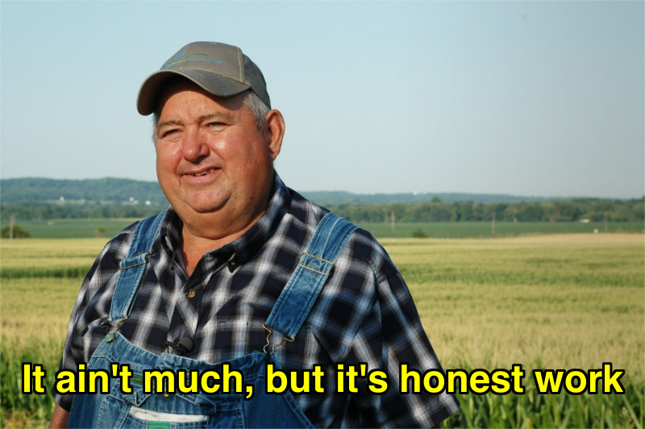

# UR3e Robot Control System

*Created by Mohammadhossein Salari for Industrial Robotics and Automated Systems*  
*UEF Summer School Courses 2025*



## Overview

A complete ROS 2 + MoveIt 2 control system for Universal Robots UR3e with Python CLI interface. Supports safe joint control with collision avoidance and headless operation.

## Quick Start

1. **Installation**: Follow [01_Installation_Guide.md](01_Installation_Guide.md) 
2. **Usage**: See [02_Running_Guide.md](02_Running_Guide.md) for step-by-step execution

## Files Structure

- **`01_Installation_Guide.md`** - Complete installation instructions
- **`02_Running_Guide.md`** - Step-by-step usage guide  
- **`setup_ur3_functions.sh`** - Bash function configuration
- **`code/`** - Python control interface
  - `cli.py` - Interactive command-line interface with readline support
  - `ur3e_lib.py` - Robot control library with collision detection
  - `ur3_types.py` - Joint position type definitions with validation
  - `robot_setup.py` - Workspace collision object configuration
  - `demo.py` - Demo routine using typed joints
  - `face_tracking_demo.py` - Robot follows detected faces with camera
  - `color_tracking_demo.py` - Robot tracks colored objects in real-time
- **`assets/`** - Images and resources

## Features

- ✅ Control the joints position UR3e with Python!
- ✅ Safe joint control with MoveIt planning
- ✅ Collision avoidance and safety checks
- ✅ Interactive CLI with readline support
- ✅ Computer vision demos with OpenCV
- ✅ Real-time face tracking and following
- ✅ Color-based object tracking (red objects)
- ✅ Type-safe joint position handling


## Commands

```bash
# Core system
ur3 run driver    # Start UR3e driver (headless mode)
ur3 run moveit    # Start MoveIt planning server
uv run cli.py     # Launch interactive control CLI

# Computer vision demos
uv run face_tracking_demo.py    # Face tracking demo
uv run color_tracking_demo.py   # Red object tracking demo
uv run demo.py                  # Basic movement demonstration
```

---
*Industrial Robotics Project - Summer 2025*
